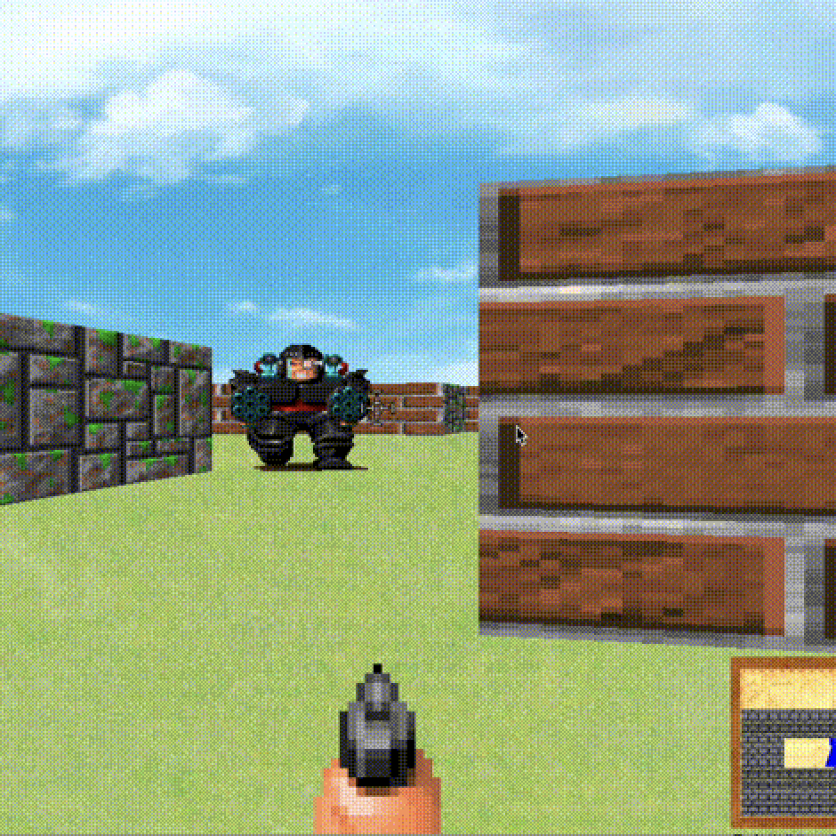
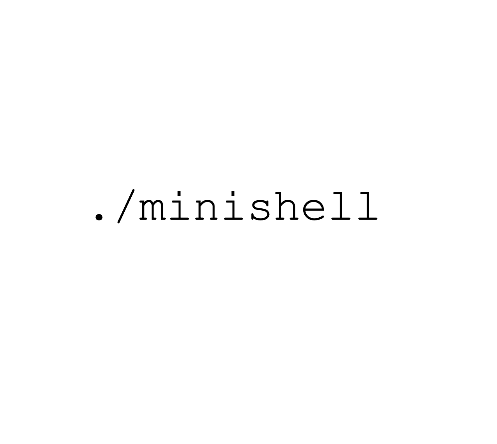
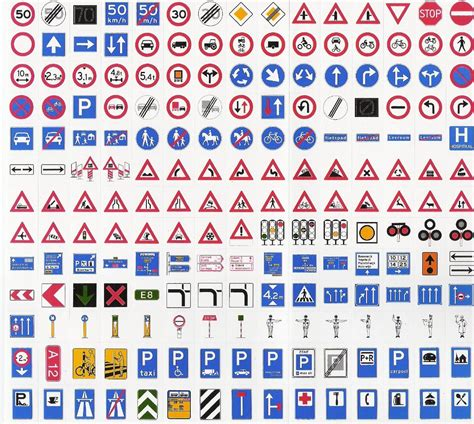
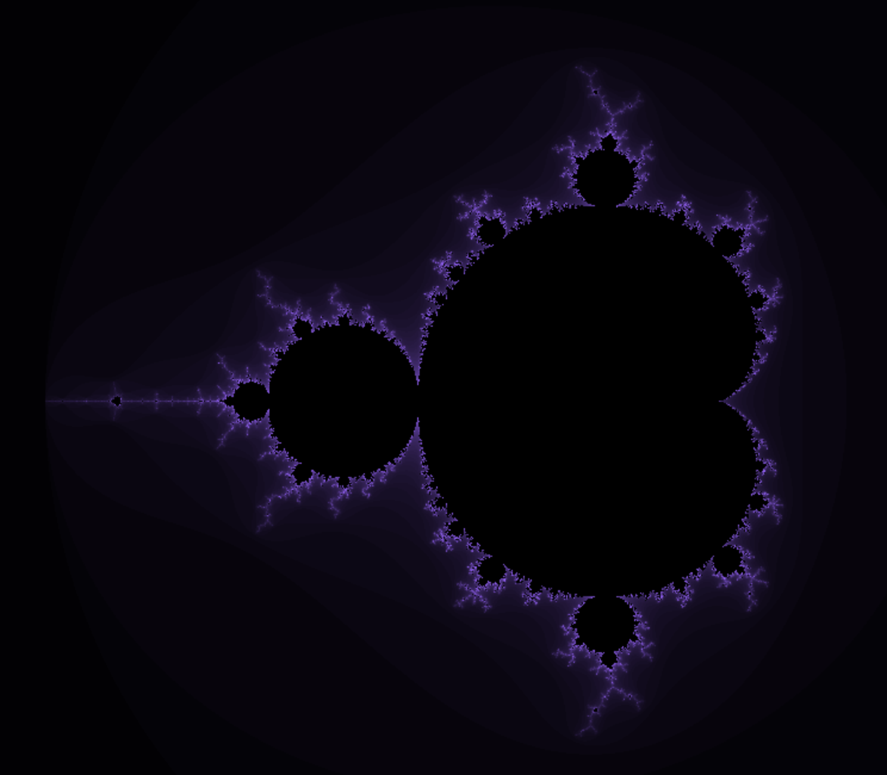

<h1 align="center">
 
</h1>
<h4 align="center">
Currently a student at 42 Lisboa, passionate about entrepreneurship, technology, and personal growth.
</h4>

 
 

  <h2 align="center"> Languages and Tools </h2>
    

      
      
	  
      
    

    

      
      
      
      
      
      
    

    

	  
	  
      
      
    

 
 
<h2 align="center">Professional Experience</h2>
<ul>
  <li><strong>Entrepreneurship & Business Innovation</strong>: 
    <ul>
      <li>BSc in Entrepreneurship & Business Innovation from Tilburg University.</li>
      <li>Founded my own startup that created a microdosing reflection guide.</li>
      <li>Marketing Lead at Maaind, a pioneering AI and neuroscience startup</li>
    </ul>
  <li><strong>Coding</strong>:
    <ul>
      <li>Pursuing the Common Core at 42 Lisboa, currently focused on the C++ modules.</li>
      <li>Harvard's CS50 Python, Web and AI course.</li>
    </ul>
  <li><strong>Facilitation & Inner work</strong>:
    <ul>
      <li>Hosting transformational retreats.</li>
      <li>Facilitating meditations, ice baths and more.</li>
    </ul>
  </li>
</ul>

 
 
<h2 align="center">Projects to Check Out</h2>

<table align="center">
  <tr>
    <td align="center" style="width: 150px;">
      <a href="https://github.com/btoksoez/cub3d" target="_blank">
         
        <strong>cub3d</strong> A 3D game with a raycaster engine.
      </a>
    </td>
    <td align="center" style="width: 150px;">
      <a href="https://github.com/btoksoez/minishell" target="_blank">
         
        <strong>minishell</strong> Replicated bash in C.
      </a>
    </td>
  </tr>
  <tr>
    <td align="center" style="width: 150px;">
      <a href="https://github.com/btoksoez/CS50AI" target="_blank">
         
        <strong>GTSRB5</strong> Trained a neural net on the GTSRB5 traffic sign dataset.
      </a>
    </td>
    <td align="center" style="width: 150px;">
      <a href="https://github.com/btoksoez/fractol" target="_blank">
         
        <strong>fractol</strong> A visual fractal generator.
      </a>
    </td>
  </tr>
</table>

 
 
<h2 align="center">About Me</h2>

I am passionate about impact-focused startups, meaningful conversations, ice baths and everything else that's fun and challenging. I love coding, traveling, meditation, health, and many other topics. In my free time, you'll find me cooking with friends, spending time in nature, and always exploring new things and connecting with others. I aim to use this short life on this rock flying through space to have positive impact, fun, and experience life to the fullest.

 
 
<h2 align="center">Let's Connect</h2>

I am always open to new encounters and ideas. Feel free to reach out!

  
  

