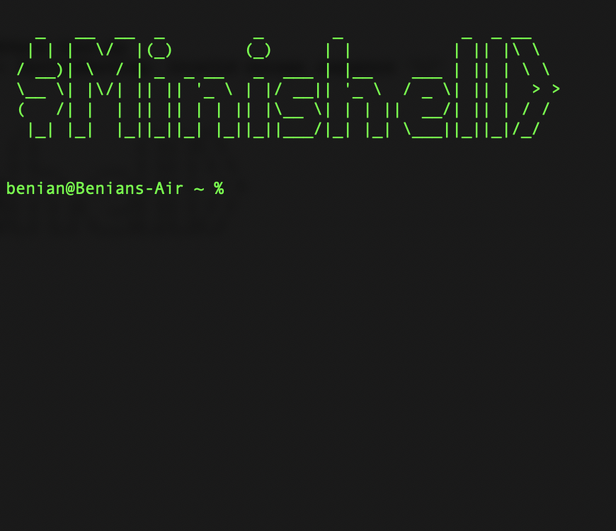

<h1 align="center">Hi, I'm Benian</h1>

      
    

<h4 align="center">
AI entrepreneur & software developer, building custom AI tools and automation systems for impactful businesses.
</h4>

 
 

<h2 align="center">💻 Tech Stack</h2>

 
 

<h2 align="center">🧠 Professional Experience</h2>

- **Founder @ Artha Labs (Current)**
  - Building AI-powered tools and automation systems for conscious, impact-driven businesses.
  - Projects include LLM-integrated business apps, full-stack development & automation building.

- **Entrepreneurship & Business Innovation**
  - BSc in Entrepreneurship & Business Innovation from Tilburg University.
  - Founded a startup around microdosing and self-reflection tools.
  - Former Marketing Lead at Maaind, an AI + neuroscience startup.

- **Software Development**
  - Studying low-level programming at 42 Lisboa (C, C++, Shell).
  - Completed Harvard CS50 courses in Python, Web Development, and AI.
  - Experienced in building modern full-stack apps with AI/LLM capabilities.

- **Facilitation & Inner Work**
  - Hosts transformational retreats focused on self-awareness and growth.
  - Facilitates breathwork, meditation, and cold exposure sessions.

 
 

<h2 align="center">🚀 Some Cool Projects</h2>

<table align="center">
  <tr>
    <td align="center" width="200px">
      <a href="https://github.com/btoksoez/cub3d">
         
        <strong>cub3d</strong> 3D raycasting game
      </a>
    </td>
    <td align="center" width="200px">
      <a href="https://github.com/btoksoez/minishell">
         
        <strong>minishell</strong> Bash shell clone in C
      </a>
    </td>
  </tr>
  <tr>
    <td align="center" width="200px">
      <a href="https://github.com/btoksoez/makemore">
         
        <strong>Makemore</strong> Autoregressive language model from scratch
      </a>
    </td>
    <td align="center" width="200px">
      <a href="https://github.com/btoksoez/fractol">
         
        <strong>fractol</strong> Fractal visualizer in C
      </a>
    </td>
  </tr>
</table>

 

<h2 align="center">🧍 About Me</h2>

I am passionate about impact-focused startups, meaningful conversations, ice baths and everything else that's fun and challenging. I love coding, traveling, meditation, health, and many other topics. In my free time, you'll find me cooking with friends, spending time in nature, and always exploring new things and connecting with others. I aim to use this short life on this rock flying through space to have positive impact, fun, and experience life to the fullest.

 

<h2 align="center">🤝 Let's Connect</h2>

  
  

